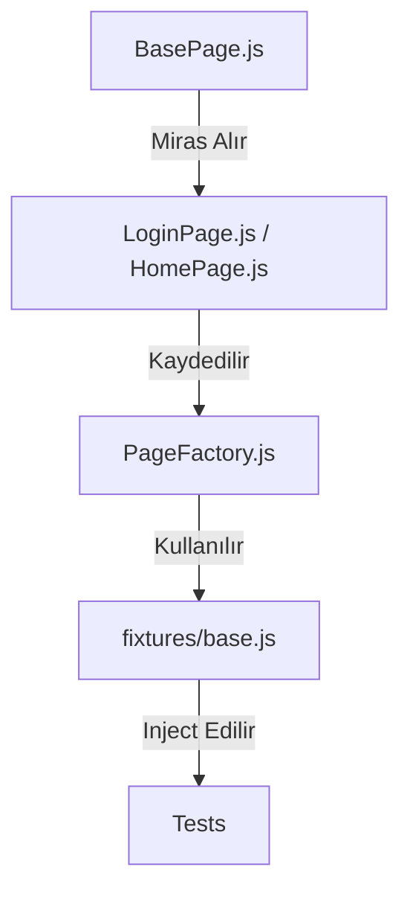

# Playwright Enterprise Automation Framework (JS)

Bu proje, modern web uygulamaları için geliştirilmiş; UI, API ve Contract (Kontrat) testlerini tek bir çatı altında toplayan profesyonel bir otomasyon framework'üdür.

---

## 💎 Framework Highlights (Sunum Özeti)

Bu framework, sadece test yazmak için değil, **kurumsal ölçekte kalite güvencesi (QA)** sağlamak için tasarlanmıştır. Öne çıkan 4 ana değer önerimiz:

1.  **⚡ Ultra Hız (Silent Auth):** UI login bekleme süresini (15s+) API tabanlı kimlik doğrulama ile **<1 saniyeye** indirdik. Okta/SAML engellerine takılmadan testlere anında başlar.
2.  **🏗️ Profesyonel Mimari (POM + Factory):** Sayfa nesneleri ve mantık katmanı birbirinden tamamen ayrılmıştır. Yeni bir test eklemek dakikalar sürer, bakım maliyeti (maintenance) minimumdur.
3.  **🔍 Gelişmiş Gözlemlenebilirlik:** Bir hata oluştuğunda sistem otomatik olarak **cURL komutu**, **video kaydı** ve **adım adım Trace logu** üretir. "Neden patladı?" sorusunun cevabı saniyeler içinde bulunur.
4.  **🎯 Komple Test Piramidi (E2E + API + Contract):** Sadece tarayıcıyı değil, servis katmanını ve veri sözleşmelerini (Pact) de test eder. %100 güvenli bir release süreci sağlar.

---

## 🚀 Hızlı Başlangıç

1.  **Bağımlılıkları Yükleyin:**
    ```bash
    npm install
    ```
2.  **Ortam Ayarlarını Yapın:**
    `.env` dosyasını oluşturun ve şunları ekleyin:
    ```env
    BASE_URL=https://...
    APP_USERNAME=...
    PASSWORD=...
    ```
3.  **Testleri Koşturun:**

### 🖥️ Temel Komutlar
*   **Tüm Testleri Koştur (Headless):**
    ```bash
    npx playwright test
    ```
*   **Tüm Testleri Koştur (Headed - UI Görünür):**
    ```bash
    npx playwright test --headed
    ```

### 🎯 Proje Bazlı Çalıştırma (Kritik)
*   **Sadece API Testlerini Koştur (Bypass Login):**
    ```bash
    npx playwright test --project=api
    ```
*   **Sadece UI Testlerini Koştur (Login Gerektirir):**
    ```bash
    npx playwright test --project=chromium
    ```
*   **Sadece Kontrat (Pact) Testlerini Koştur:**
    ```bash
    npx playwright test --project=contract
    ```

### 🏷️ Tag (Etiket) Yönetimi ve Standartları

Framework, testlerin kategorize edilmesi ve seçici olarak çalıştırılması için Playwright'ın yerleşik `--grep` (regex tabanlı filtreleme) özelliğini kullanır.

#### 🏗️ Etiketleme Mimarisi

| Etiket | Tanım | Çalıştırma Komutu |
| :--- | :--- | :--- |
| `@smoke` | Sistemin en kritik fonksiyonları (Login, Sepete Ekle vb.) | `npm run test:smoke` |
| `@regression` | Tüm detaylı kontrol ve uç senaryolar. | `npm run test:regression` |
| `@sanity` | Temel işlevsel doğrulamalar. | `npm run test:sanity` |
| `@api` | Sadece API katmanı testleri. | `npx playwright test --grep @api` |
| `@ui` | Sadece tarayıcı üzerinden koşan testler. | `npx playwright test --grep @ui` |

#### 🚀 Kullanım Standartları

**1. Test Düzeyinde Etiketleme:**
Tekil bir teste etiket eklemek için başlığın sonuna ekleyin:
```javascript
test('Giriş yapılabilmeli @smoke', async ({ pages }) => { ... });
```

**2. Grup (Describe) Düzeyinde Etiketleme:**
Bloğa eklenen etiketler içindeki tüm testler için geçerli olur:
```javascript
test.describe('Kullanıcı API Testleri @api @regression', () => { ... });
```

**3. Çoklu Etiketleme:**
Bir test birden fazla etikete sahip olabilir:
```javascript
test('Ödeme Testi @api @smoke', ...);
```

#### 🛠️ İleri Seviye Filtreleme Komutları

| Senaryo | Mantık | Komut |
| :--- | :--- | :--- |
| **VEYA (OR)** | `@smoke` veya `@api` olanları çalıştırır. | `npx playwright test --grep "@smoke\|@api"` |
| **VE (AND)** | Hem `@api` hem `@smoke` olanları çalıştırır. | `npx playwright test --grep "(?=.*@api)(?=.*@smoke)"` |
| **DEĞİL (Invert)** | `@regression` olsun ama `@api` olmasın. | `npx playwright test --grep @regression --grep-invert @api` |

> [!IMPORTANT]
> **Kural:** Her yeni test bloğu, raporlama düzeni için en az bir standart etiket (Örn: `@smoke` veya `@regression`) içermelidir.

### 🔍 Dosya ve Debug Bazlı
*   **Belirli Bir Test Dosyasını Çalıştır:**
    ```bash
    npx playwright test tests/api/cms.spec.js
    ```
*   **Hata Ayıklama (Debug) Modunda Aç:**
    ```bash
    npx playwright test --debug
    ```
*   **UI Mode (Playwright'ın interaktif arayüzü):**
    ```bash
    npx playwright test --ui
    ```

---

## ⚡ Test Yazımını Hızlandırın (Playwright Recorder)

Yeni test senaryolarını ve lokatörleri hızlıca tespit etmek için Playwright'ın dahili **Recorder** (codegen) aracını kullanabilirsiniz. Bu sistem, `.env` dosyasındaki `BASE_URL`'i otomatik yükler ve her oturum sonrası temizlik yapar.

### 🎥 Adım Adım Kullanım:

1.  **Aracı Başlatın:**
    ```bash
    # 1. İlk Kurulum (İlk kez kullanırken veya insan doğrulaması çıkarsa bir kez çalıştırın)
    npm run codegen:stealth-save

    # 2. Günlük Kullanım (İkinci seferden itibaren; doğrulamayı aşmak için bunu kullanın)
    npm run codegen:stealth
    ```
2.  **Etkileşime Geçin:** Açılan tarayıcıda senaryonuzu gerçekleştirin. Kodlar **Inspector** penceresinde üretilecektir.
3.  **Lokatör Tespiti:** Pick Locator ile sayfadaki öğelerin en uygun selector'larını (`getByRole` vb.) kopyalayın.
4.  **Oturumu Sıfırlama:** Eğer Stealth verilerini tamamen silmek isterseniz:
    ```bash
    npm run codegen:reset
    ```

> [!TIP]
> **Doğrulamayı Aşma İş Akışı:** İlk çalıştırmada `stealth-save` ile sayfayı açın ve bot doğrulamasını (CAPTCHA) geçin. Sonra pencereyi kapatın. Artık her seferinde `stealth` komutunu kullanarak Google/Cloudflare gibi doğrulamalara takılmadan hızlıca kayıt yapabilirsiniz.

---

## 📂 Proje Yapısı ve Haritası

Bu framework, **Single Responsibility** (Tek Sorumluluk) prensibine göre klasörlenmiştir:

### 📐 Mimari Akış


### ⚙️ Core & Mimari
*   **`api/`**: API Page Object Model (POM) yapısı.
    *   `BaseService.js`: Tüm API isteklerinin (GET, POST vb.) geçtiği merkezi sarmalayıcı. Hata loglama ve header yönetimi burada yapılır.
    *   `services/`: Endpoint bazlı özelleşmiş sınıflar (AuthService, CmsService vb.).
*   **`pages/`**: UI testleri için klasik Page Object Model yapısı.
*   **`fixtures/`**: Playwright servislerini (`loginPage` vb.) testlere otomatik enjekte eden altyapı.

### 🧪 Test Kategorileri (`tests/`)
*   **`tests/ui/`**: Kullanıcı arayüzü (Browser) testleri.
*   **`tests/api/`**: Servis katmanı testleri. **DDT (Data-Driven)** yapısını kullanır.
*   **`tests/contract/`**: Pact kullanarak yapılan tüketici tarafı kontrat testleri.
*   **`data/`**: Testlerde kullanılan dinamik verilerin (JSON formatında) tutulduğu yer.

> [!TIP]
> **Etiketleme (Tagging) Standartı:** Yeni bir test eklerken başlığın sonuna mutlaka uygun etiketleri ekleyin (Örn: `@smoke @ui`). Playwright hiyerarşik etiketlemeyi destekler; bir test hem `@api` hem `@regression` etiketine sahip olabilir. Detaylı teknik standartlar için `implementation_plan.md` dosyasına bakabilirsiniz.

### 📖 Dosya ve Klasör Sözlüğü

| Dizin / Dosya | Görevi |
| :--- | :--- |
| **`api/BaseService.js`** | Tüm API isteklerinin merkezi motorudur. cURL üretimi ve hata loglama buradan yapılır. |
| **`api/services/`** | Endpoint bazlı servis sınıflarını (AuthService, CmsService vb.) barındırır. |
| **`pages/BasePage.js`** | UI sayfaları için temel sınıftır. Tıklama, veri girişi gibi ortak metodları içerir. |
| **`pages/PageFactory.js`** | Tüm UI sayfalarını merkezi bir yerden yöneten ve testlere dağıtan fabrikadır. |
| **`fixtures/base.js`** | Playwright testlerine sayfa nesnelerini otomatik "inject" eden altyapıdır. |
| **`tests/auth.setup.js`** | Testler başlamadan önce API üzerinden sessiz login olup oturum saklayan ilk adımdır. |
| **`tests/ui/`** | Browser tabanlı son kullanıcı senaryolarını içerir. |
| **`tests/api/`** | Servis katmanı ve veri odaklı (DDT) fonksiyonel testleri barındırır. |
| **`tests/contract/`** | Pact kullanarak Backend/Frontend arasındaki veri uyumunu denetler. |
| **`data/`** | Testlerde kullanılan dinamik ve statik JSON verilerini saklar. |
| **`playwright.config.js`** | Framework'ün tüm çalışma parametrelerini (timeout, browser, reporter) belirler. |
| **`.env`** | Şifreler ve URL'ler gibi hassas ortam değişkenlerini barındırır. |

---

## 🛠️ Önemli Teknik Özellikler

### 1. Silent Authentication (API-Based Bypass)
Proje, her testte tekrar UI üzerinden login olmak yerine `auth.setup.js` üzerinden **API kullanarak** sessizce login olur. 
- **Hız:** UI login (15s) vs API login (500ms).
- **Stabilite:** Okta CAPTCHA veya Headless bloklamalarını bypass eder.
- **Saklama:** Oturum bilgisi `playwright/.auth/user.json` dosyasında saklanır ve tüm testlere otomatik dağıtılır.

### 2. Centralized Error Handling & Logging (API)
`BaseService` içinde kurulu olan `_handleError` mekanizması sayesinde, bir API testi patladığında veya network hatası oluştuğunda terminalde şunlar otomatik görünür:
- **URL & Method:** İsteğin nereye ve nasıl atıldığı.
- **Duration (Süre):** İsteğin kaç `ms` sürdüğü (Performans takibi için).
- **cURL Komutu:** Hatayı localde simüle edebilmeniz için hazır kopyala-yapıştır komut.
- **Pretty Response:** JSON yanıtların formatlanmış hali.

**Örnek Hata Çıktısı:**
```text
--- ⛔ API ERROR DETECTED ⛔ ---
Timestamp : 2026-01-18T10:42:12.643Z
URL       : https://api.example.com/v1/users
Method    : POST
Status    : 400 (Bad Request)
Duration  : 748ms
cURL      : curl -X POST "https://api.example.com/v1/users" -d '{"name": "John"}'
Request Body/Params :
{
  "name": "John"
}
Response Body :
{
  "error": "Missing field: email",
  "code": "VALIDATION_ERROR"
}
-----------------------------------
```

### 3. Data-Driven Testing (DDT)
API testleri (`cms.spec.js`), veriyi kod içinden değil `data/` altındaki JSON dosyalarından çeker. Böylece kod değişmeden onlarca farklı senaryo koşturulabilir.

### 4. Pact Contract Testing
Backend ve Frontend arasındaki veri sözleşmesini garanti altına almak için `tests/contract/` altında kontrat testleri bulunur. Oluşturulan kontratlar `pacts/` klasöründe saklanır.

---

### 4. Gelişmiş Raporlama & Hata Kanıtları
Framework, kurumsal seviyede hata ayıklama kanıtları toplar:
- **JUnit Raporu:** `results.xml` dosyası oluşturulur (CI/CD Dashboardları için).
- **Video Kaydı:** Bir test patladığında (`retain-on-failure`), o anın ekran kaydı `test-results/` klasörüne kaydedilir.
- **Trace Viewer:** Hata anındaki tüm network ve konsol loglarını içeren detaylı izleme dosyası saklanır.
- **Manuel Screenshot:** `BasePage` üzerinden alınan özel ekran görüntüleri `test-results/manual-screenshots/` altına gider.

### 📊 Raporları Görüntüleme
*   **HTML Raporu:** `npx playwright show-report`
*   **Trace İnceleme:** `npx playwright show-trace path/to/trace.zip`

---

## 💡 Yeni Bir Test Nasıl Eklenir?

### 🌐 1. Yeni Bir UI Sayfası ve Testi Ekleme (POM + Factory)

Framework, profesyonel **PageFactory** ve **BasePage** mimarilerini kullanır. Yeni bir sayfa eklemek için şu 4 adımı izleyin:

#### **Adım 1: Sayfa Sınıfını Oluşturun**
`pages/` altında yeni klasör ve dosya oluşturun (Örn: `home/HomePage.js`). Bu sınıf `BasePage`'den miras almalıdır:
```javascript
const { BasePage } = require('../BasePage');

class HomePage extends BasePage {
    constructor(page) {
        super(page);
        this.searchBar = page.locator('#search');
    }
    async search(text) {
        await this.fillInput(this.searchBar, text); // BasePage metodunu kullan
    }
}
module.exports = { HomePage };
```

#### **Adım 2: PageFactory'ye Kaydedin**
`pages/PageFactory.js` dosyasına gidin, sayfanızı import edin ve `this.pages` nesnesine ekleyin:
```javascript
const { HomePage } = require('./home/HomePage'); // 1. Import et

// ... constructor içinde ...
this.pages = {
    loginPage: LoginPage,
    homePage: HomePage, // 2. Buraya ekle
};
```

#### **Adım 3: Test Yazın**
`tests/ui/` altında test dosyanızı oluşturun. Fixture olarak sadece `pages` almanız yeterlidir:
```javascript
const { test } = require('../../fixtures/base');

test('Arama testi', async ({ pages }) => {
    const homePage = pages.get('homePage'); // Factory'den çağır
    await homePage.navigateTo('/');
    await homePage.search('Playwright');
});
```

#### **Adım 4: Başarıyı Doğrulayın**
```bash
npx playwright test tests/ui/home.spec.js
```

### 📡 2. API Testi Ekleme (DDT & POM)

Framework, API testlerinde **Data-Driven (Veri Odaklı)** ve **Schema Validation** yaklaşımlarını kullanır.

#### **Adım 1: Servis Sınıfını Oluşturun**
`api/services/` altında yeni servis oluşturun (Örn: `UserService.js`). `BaseService` metodlarını kullanarak endpoint'leri tanımlayın:
```javascript
const { BaseService } = require('../BaseService');

class UserService extends BaseService {
    async getUser(id) {
        return this.get(`/api/users/${id}`);
    }
}
module.exports = { UserService };
```

#### **Adım 2: Test Verisini Hazırlayın**
`data/` altında JSON formatında senaryolarınızı tanımlayın:
```json
[
  { "desc": "Geçerli kullanıcı sorgusu", "userId": 1, "expectedStatus": 200 },
  { "desc": "Olmayan kullanıcı sorgusu", "userId": 99, "expectedStatus": 404 }
]
```

#### **Adım 3: Testi Yazın ve Şemayı Doğrulayın**
`tests/api/` altında `.spec.js` dosyanızı oluşturun. `ajv` ile yanıt yapısını kontrol edin:
```javascript
const { test, expect } = require('@playwright/test');
const { UserService } = require('../../api/services');
const userData = require('../../data/user_data.json');

for (const data of userData) {
    test(`Sorgu: ${data.desc}`, async ({ request, baseURL }) => {
        const userService = new UserService(request, baseURL);
        const response = await userService.getUser(data.userId);
        expect(response.status()).toBe(data.expectedStatus);
    });
}
```

---

### 🤝 3. Contract (Pact) Testi Ekleme

Frontend ve Backend arasındaki "Sözleşmeyi" garanti altına almak için `tests/contract/` altındaki yapıyı kullanın.

#### **Adım 1: Pact Nesnesini Tanımlayın**
Tüketici (Consumer) ve Sağlayıcı (Provider) isimlerini belirleyerek testi başlatın:
```javascript
const provider = new PactV3({
    consumer: 'Frontend-App',
    provider: 'User-Service',
    dir: path.resolve(process.cwd(), 'pacts'),
});
```

#### **Adım 2: Beklenen Etkileşimi (Interaction) Ekleyin**
Hangi isteğe hangi yanıtın dönmesi gerektiğini (`MatchersV3` ile) tanımlayın:
```javascript
provider.addInteraction({
    state: 'user records exist',
    uponReceiving: 'a request for user 1',
    withRequest: { method: 'GET', path: '/api/users/1' },
    willRespondWith: {
        status: 200,
        body: { id: 1, name: 'John Doe' }
    }
});
```

#### **Adım 3: Mock Server Üzerinde Doğrulayın**
`provider.executeTest` bloğu içinde gerçek servis sınıfınızı (UserService) mock server'a yönlendirerek testi koşturun:
```javascript
await provider.executeTest(async (mockServer) => {
    const userService = new UserService(request, mockServer.url);
    const response = await userService.getUser(1);
    expect(response.status()).toBe(200);
});
```
---

## 🏆 Standartlar ve En İyi Uygulamalar (Best Practices)

Framework'ün kalitesini korumak için şu kurallara uyulması zorunludur:

1.  **Güvenli Etkileşim:** Asla standart `page.click()` kullanmayın. Daima `BasePage` içindeki `clickSafe()` metodunu kullanın (Bekleme ve görünürlük kontrolü içerir).
2.  **Hard-Wait Yasağı:** `await page.waitForTimeout(5000)` gibi sabit beklemeler kesinlikle yasaktır. Daima element bazlı (`waitForVisible`) beklemeler kullanın.
3.  **Selector Yönetimi:** Selector'lar asla `.spec.js` veya `.js` dosyaları içine doğrudan yazılmaz. Daima ilgili klasördeki `locators.json` dosyasından okunmalıdır.
4.  **Hata Mesajları:** `expect` içinde mutlaka hata mesajı belirtin. 
    - *Kötü:* `expect(val).toBe(true)`
    - *İyi:* `expect(val, 'Ürün listesi boş gelmemeli').toBe(true)`

---

## 🚀 CI/CD Entegrasyonu

Framework, her türlü CI/CD aracıyla uyumludur. Örnek **GitHub Actions** iş akışı (`.github/workflows/tests.yml`):

```yaml
jobs:
  test:
    runs-on: ubuntu-latest
    steps:
      - uses: actions/checkout@v3
      - uses: actions/setup-node@v3
      - name: Install dependencies
        run: npm install
      - name: Run Playwright tests
        run: npx playwright test
        env:
          BASE_URL: ${{ secrets.BASE_URL }}
          APP_USERNAME: ${{ secrets.APP_USERNAME }}
          PASSWORD: ${{ secrets.PASSWORD }}
      - uses: actions/upload-artifact@v3
        if: always()
        with:
          name: playwright-report
          path: playwright-report/
```

---

## 🛠️ Sorun Giderme (Troubleshooting)

| Sorun | Olası Çözüm |
| :--- | :--- |
| **VPN Hatası (Timeout)** | Şirket dışı ağlardaysanız VPN'in açık ve UAT adreslerine erişiminizin olduğunu kontrol edin. |
| **Trace Görünmüyor** | Testin gerçekten "fail" olduğundan emin olun (Sadece başarısızlarda trace saklanır). |

---
