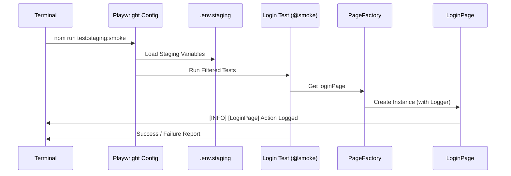

# Case Study: `npm run test:staging:smoke` Çalışma Akışı

Bu döküman, projenizde bir test komutu çalıştırdığınızda arkada dönen tüm mekanizmayı (Environment yönetimi, POM, Logger ve Raporlama) adım adım açıklar.

## 🚀 Senaryo Başlangıcı
Terminalde şu komutu çalıştırdınız: 
`npm run test:staging:smoke`

---

### Adım 1: Script Tetiklenmesi (package.json)
`npm` önce `package.json` dosyasına bakar ve şu komutu çözümler:
- **Komut:** `cross-env ENV=staging npx playwright test --grep @smoke`
- **İşlem:** `cross-env` kütüphanesi, işletim sisteminden bağımsız olarak (Mac/Windows/Linux) `ENV` isimli bir değişkeni "staging" değeriyle belleğe (process.env) yazar.

### Adım 2: Yapılandırma ve Ortam Seçimi (playwright.config.js)
Playwright kalkarken config dosyasına girer ve şu kodları çalıştırır:
1. `const env = process.env.ENV || '';` -> Bellekten "staging" değerini okur.
2. `path.resolve(__dirname, 'environments', `.env.${env}`)` -> Yolunu `environments/.env.staging` olarak belirler.
3. `dotenv.config({ path: envPath })` -> Bu dosyayı açar ve içindeki `BASE_URL`, `APP_USERNAME` vb. değerleri belleğe yükler.
4. **Hata Kontrolü:** Eğer `BASE_URL` yüklenmemişse, sistemi durdurur ve size "🚨 KRİTİK HATA" uyarısı verir.

### Adım 3: Testlerin Taranması ve Filtreleme (Filtering)
Playwright `./tests` klasöründeki tüm dosyaları tarar:
- `--grep @smoke` parametresi sayesinde sadece içinde `@smoke` etiketi geçen testleri seçer (Örn: `login.spec.js`).

### Adım 3.5: Global Setup - Sessiz Oturum Açma (Silent Auth)
Eğer koşturulan test UI projesine (`chromium`) aitse:
1. Playwright önce `tests/auth.setup.js` dosyasını çalıştırır.
2. `AuthService` üzerinden API ile hızlıca login olunur.
3. Gelen session/cookie bilgileri `playwright/.auth/user.json` dosyasına kaydedilir.
4. **Sonuç:** Testleriniz başladığında tarayıcı zaten "Giriş Yapılmış" olarak açılır, her testte saniyelerce login beklemek zorunda kalmazsınız.

### Adım 4: Fixture ve PageFactory Devreye Giriyor
Test başlamadan hemen önce `fixtures/base.js` içindeki yapı ayağa kalkar:
1. Bir `PageFactory` nesnesi oluşturulur.
2. Bu factory, içinde `LoginPage`, `HomePage` gibi nesneleri henüz "uylukta" (lazy initialization) hazır bekletir.
3. Teste `pages` parametresi olarak inject edilir.

### Adım 5: Sayfa Nesnesi ve Logger Oluşumu (POM)
Test dosyanızda (`login.spec.js`) şu satır çalıştığında:
`const loginPage = pages.get('loginPage');`

1. `PageFactory` gider `LoginPage` sınıfından bir instance oluşturur.
2. **Kritik Nokta:** `BasePage` constructor'ı sayesinde `LoginPage` için özel bir **Logger** oluşturulur.
   - *Log Çıktısı:* `[LoginPage] Initialized`

### Adım 6: Test Adımları ve Akıllı Etkileşimler
`await loginPage.navigateToLogin();` komutu çalıştığında:
1. **Logger:** Terminale `[INFO] [LoginPage] Navigating to login page...` yazar.
2. **Playwright Step:** Aynı zamanda Playwright'ın HTML raporuna "Navigating to login page..." adımı eklenir.
3. **Safe Interaction:** `clickSafe()` veya `fillInput()` metodları kullanılır. Bu metodlar önce elementin görünmesini bekler, sonra işlem yapar ve sonucu loglar.

### Adım 6.5: API Şema Doğrulama (Sadece API Testleri İçin)
Eğer bir API testi koşuyorsa:
1. `BaseService` üzerinden gönderilen istek sonrası gelen JSON cevabı alınır.
2. `validateSchema()` metodu AJV kütüphanesini kullanarak gelen veriyi (Sayı mı, String mi?) saniyeler içinde denetler.
3. Veri yapısı hatalıysa, test anında "Contract Violation" hatasıyla durur.

### Adım 7: Hata Durumu ve Verifikasyon (Hata Varsa Ne Olur?)
Diyelim ki Staging'de uygulama yavaş ve bir element bulunamadı:
1. **Screenshot:** Playwright otomatik olarak o anın ekran görüntüsünü alır (`only-on-failure`).
2. **Logger:** Centralized Logger terminale büyük kırmızı bir `[ERROR]` bloğu basar. 
3. **API Logları:** Eğer hata bir API isteğinden kaynaklıysa, `BaseService.js` terminale otomatik olarak **cURL** komutunu ve yanıt gövdesini (Body) basar.

### Adım 8: Raporlama ve CI Entegrasyonu
Test tamamlandığında:
- **HTML Rapor:** `playwright-report/index.html` dosyası güncellenir. Burada her logu görsel bir ağaç yapısında görebilirsiniz.
- **JUnit Rapor:** CI sistemlerinin (Jenkins vb.) okuyabilmesi için `results.xml` dosyası oluşturulur.
- **Terminal:** Eğer `CI=true` değilse HTML raporu otomatik açılmaz, sadece özet listelenir.

---

## 🛠 Özet Mimari Akış Şeması (Mermaid)

